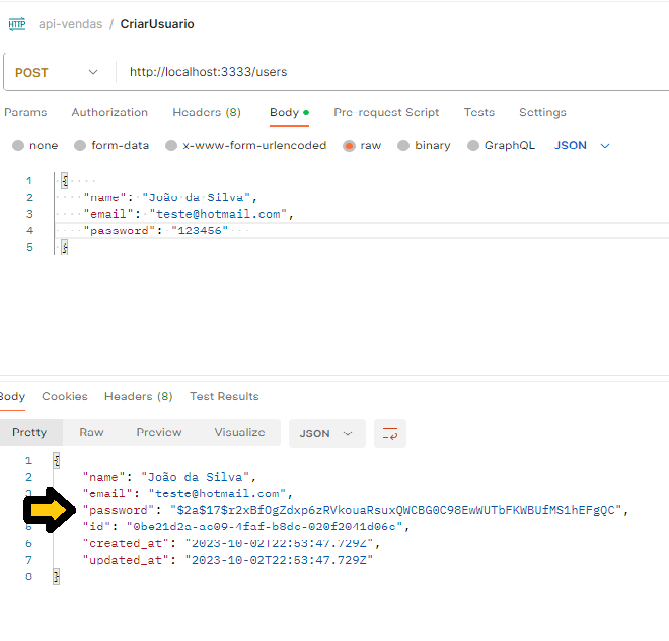

# Api - Complexa Typescript

​    Ao final deste projeto pretende-se ter uma api para um site de vendas, construído em typescript utilizando recursos avançados de gerenciamento de senhas, gerenciamento de perfis de usuário, módulo de pedidos de compras, cache com Redis e muito mais.

​    Foram utilizadas ferramentas como EditorConfig,  Eslint e Prettier para organização de código.

      

​    Estrutura de pastas da aplicação:

- Na pasta config ficarão as configurações de bibliotecas externas, como por exemplo autenticação, upload, email, etc

- Na pasta modules, ficaram as pastas que abrangem a área de conhecimento da aplicação, a princípio customers, products, orders e users

- Na pasta shared ficaram módulos de utilização geral, compartilhados por toda a aplicação.
  
  

Regras:

A princípio, a aplicação atenderá as seguintes regras;

- A senha deve ser armazenada por criptografia com demonstrado
  

- Não pode haver mais de um produto com o mesmo nome

- Não pode haver um mesmo email sendo utilizado por mais de um usuário
  
  

Serão aplicados conhecimentos em  Desing Pattern, testes automatizados e Docker.

​    Na pasta  git api-vendas encontra-se o código. 

​    O projeto é um trabalho em progresso. Isso significa que até mesmo esta descrição deverá sofrer alterações a medida que o desenvolvimento avança.

​    Dados poderão ser acrescentados ou subtraídos.

​    Caso tenha alguma dúvida não hesite em enviar um email. Farei o possível para responder no menor tempo possível.

​                                                                     **Lindomar Farineli**
